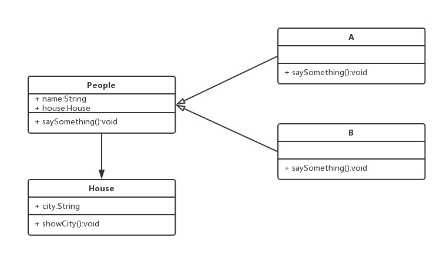
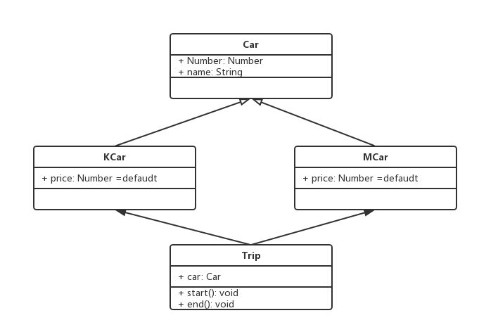

### 1. 为何使用面向对象 ###
- 程序执行：顺序、判断、循环 —— 结构化
- 面向对象 —— 数据结构化
- 对于计算机，结构化的才是最简单的
- 编程应该 简单&抽象
### 2. UML类图怎么画
#### 1、类图练习 ####

#### 2、打车类图

### 3. 设计准则 ###
1. 小即是美
2. 让每个程序只做好一件事
3. 快速建立原型（先用，再迭代）
4. 舍弃高效率而取可移植性
5. 采用纯文本来存储数据（虽然二进制更适合计算机）
6. 充分利用软件的杠杆效应（软件复用）
7. 使用shell脚本来提高杠杆效应和可移植性
8. 避免强制性的用户界面
9. 让每个程序都成为过滤器（小而美）
#### 小准则 ####
1. 允许用户定制环境
2. 尽量使操作系统内核小而轻量化
3. 使用小写字母并尽量简短
4. 沉默是金
5. 各部分之和大于整体
6. 寻求90%的解决方案（只解决80%的需求）
### 4. SOLID五大设计原则 ###
| 字符        | 含义   |
| -----   | -----  |
| S     | 单一职责原则 |
| O     | 开放封闭原则 |
| L     | 李氏置换原则 |
| I     | 接口独立原则 |
| D     | 依赖导致原则 |

> 单一职责原则
- 一个程序只做好一件事
- 如果功能过于复杂就拆开，每个部分保持独立
> 开放封闭原则
- 对扩展开发，对修改封闭
- 增加需求时，扩展新代码，而非修改已有代码
- 这是软件设计的终极目标
> 李氏置换原则
- 子类能覆盖父类
- 父类能出现的地方，子类就能出现
- JS中使用较少（弱类型&继承使用较少）
> 接口独立原则
- 保持接口的单一独立，避免出现 “胖接口”
- JS中没有接口（typescript例外），使用较少
- 类似S, 更专注于接口
> 依赖导致原则
- 面向接口编程，依赖于抽象而不是依赖于具体
- 使用放只关注接口而不关注具体类的实现
- JS中使用较少（没有接口&弱类型）